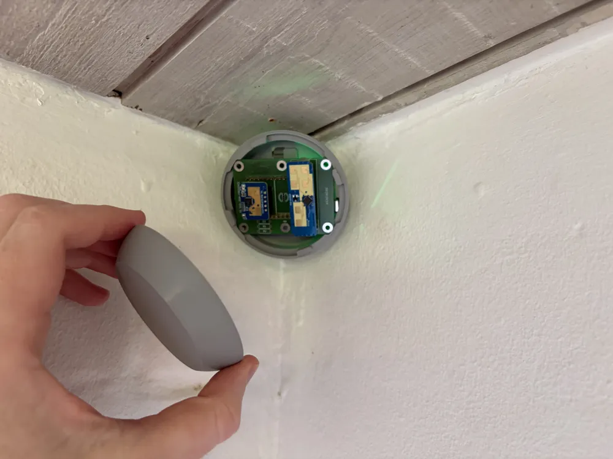
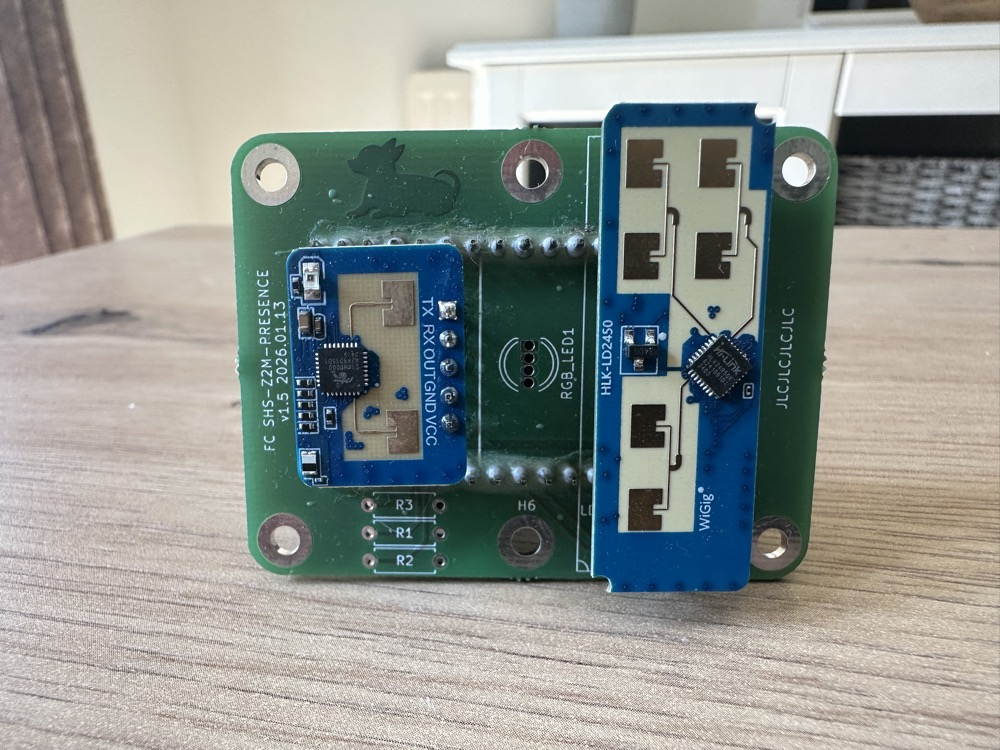
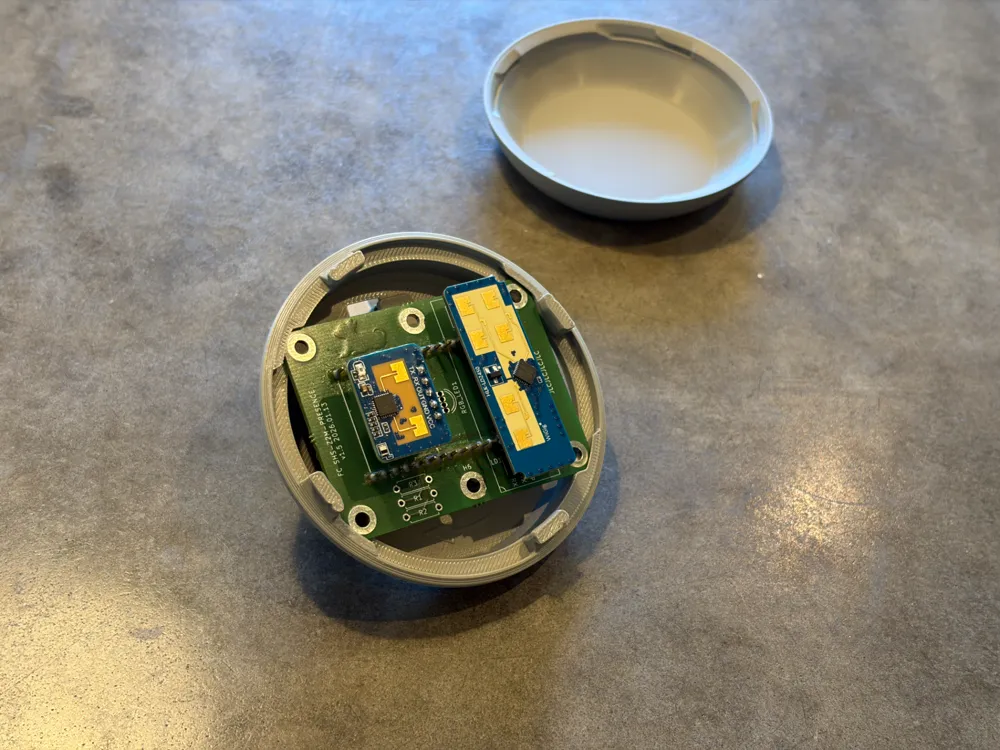
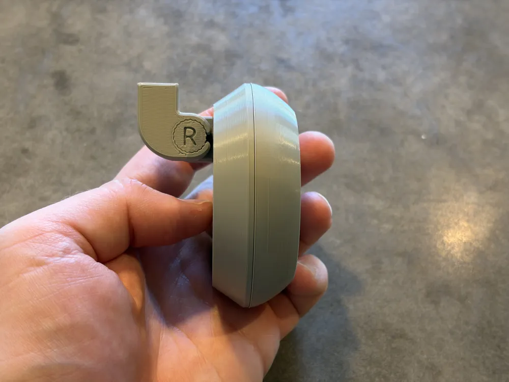
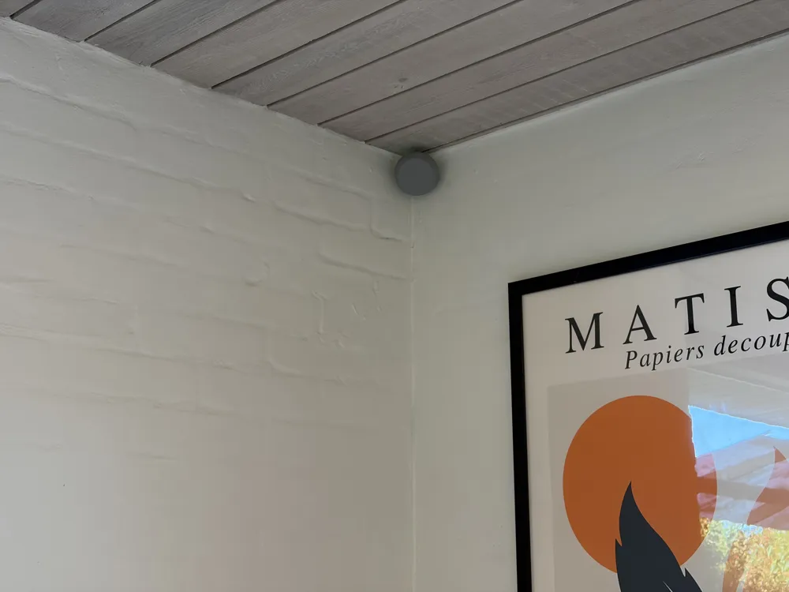

# SHS-Z2M-Presence

**Dual mmWave Presence Sensor Firmware for ESP32-C6 with Zigbee2MQTT Support**



---

## Overview

This project is a continuation of the original [**Smart Home Scene** DIY Zigbee mmWave presence sensor](https://smarthomescene.com/guides/diy-zigbee-mmwave-presence-sensor-with-esp32-c6-and-ld2410/) made for the ESP32-C6 + LD2410. This enhanced firmware now supports the **LD2450** sensor for **multi-zone detection** and **multi-target tracking** (up to 3 simultaneous targets).

The sensor is fully compatible with **Zigbee2MQTT** and works seamlessly with Home Assistant.

### Companion Home Assistant Add-on


For the best experience, install the **SHS Z2M Presence Zone Configurator** add-on for Home Assistant. It allows you to:

- Create rooms with custom floor plans
- Add furniture and obstacles to your map
- Draw and configure detection zones visually
- Set up interference zones to filter false positives
- Real-time target tracking visualization

**[SHS Z2M Presence Zones Add-on →](https://github.com/notownblues/SHS-Z2M-Presence-Zones)**

---

## Community

I wanted to thank both **u/otherworld-dev** and **Rune** from [runesblog.com](https://runesblog.com) for their amazing contributions to this project. It's been incredible to see people work together on this, and also the support this project has received from the community.

### Custom PCB — by u/otherworld-dev

After discovering this project on r/homeassistant, u/otherworld-dev designed a custom PCB that integrates the ESP32-C6, LD2410C, and LD2450 into a single clean board — no breadboard or loose wiring required.

> ⚠️ **The PCB is only compatible with the [ESP32-C6-DevKitC-1-N8](https://eu.mouser.com/ProductDetail/Espressif-Systems/ESP32-C6-DevKitC-1-N8).** Other ESP32-C6 boards will not work as the pins won't align properly with the PCB.

| | |
|---|---|
|  |  |

**[Order the PCB on PCBWay →](https://www.pcbway.com/project/shareproject/SHS_Z2M_Presence_ESP_32_439c9c21.html)**

### 3D Printed Case — by Rune (runesblog.com)

I came across [Rune's work](https://www.facebook.com/groups/HomeAssistant/permalink/4289785924626078/) in the Home Assistant Facebook group a few months back. He'd been designing enclosures for ESP boards which I loved. I reached out, and he was kind enough to design a case specifically for this project. Please make sure to check his work at [runesblog.com](https://runesblog.com).

| | |
|---|---|
|  |  |
|  |  |

**[Download the 3D model on MakerWorld →](https://makerworld.com/en/models/2959145-shs-z2m-presence-adjustable-case-mount#profileId-3316652)**

---

## Hardware Requirements

| Component | Purpose |
|-----------|---------|
| ESP32-C6 | Zigbee-enabled microcontroller |
| LD2410C | Presence detection (moving/static) |
| LD2450 | Multi-target position tracking & zones |
| BH1750 *or* LTR390 | Ambient light (lux); the LTR390 adds UV index — optional |

---

## Hardware Setup

Choose the setup option that best matches your situation:

### Option 1: Custom PCB

The easiest path. The [community-designed PCB](#custom-pcb--by-uotherworld-dev) integrates all components on a single board — flash the firmware and pair the device, no wiring needed.

**[Order on PCBWay →](https://www.pcbway.com/project/shareproject/SHS_Z2M_Presence_ESP_32_439c9c21.html)**

### Option 2: 3D Printed Case

Pair the custom PCB with Rune's adjustable ceiling mount case for a clean, finished install.

**[Download on MakerWorld →](https://makerworld.com/en/models/2959145-shs-z2m-presence-adjustable-case-mount#profileId-3316652)**
**[Flat one on Printables](https://www.printables.com/model/1623562-case-for-shs-z2m-presence)**

### Option 3: Standard ESP32-C6 Wiring

For a DIY build on a bare ESP32-C6 development board.


#### LD2410C
- TX (LD2410C) → GPIO4 (RX1) on ESP32-C6
- RX (LD2410C) → GPIO5 (TX1) on ESP32-C6
- VCC → 5V
- GND → GND

#### LD2450
- TX (LD2450) → GPIO19 (RX0) on ESP32-C6
- RX (LD2450) → GPIO18 (TX0) on ESP32-C6
- VCC → 5V
- GND → GND

> **Note:** Some ESP32-C6 boards have 2 x 5V pins and some have one. Both sensors can share the same 5V pin or use separate ones if available.

#### Ambient light sensor — BH1750 *or* LTR390 (optional)

Either sensor works with the same firmware image and the same wiring. They sit at
different I2C addresses, so the firmware probes for both at boot and uses whichever
answers — there is nothing to configure and no separate build.

| Sensor | I2C address | Provides |
|---|---|---|
| BH1750 | `0x23` | `illuminance` (lux) |
| LTR390 | `0x53` | `illuminance` (lux) **and** `uv_index` |

Wiring, identical for either part:

| Sensor pin | ESP32-C6 pin | Notes |
|------------|--------------|-------|
| VCC | **3V3** | Not the 5V rail the radars use — see the note below |
| GND | GND | |
| SDA | GPIO6 | I2C data |
| SCL | GPIO7 | I2C clock |
| ADDR | GND | **BH1750 only** — selects `0x23`. GY-302/GY-30 breakouts already pull this low, so it can be left unconnected on those. Tied high the module answers on `0x5C` and will not be found. |

The firmware drives I2C at 100 kHz with the ESP32-C6's internal pull-ups enabled, so
no external pull-up resistors are needed for the short leads inside a case (breakout
boards carry their own anyway). Pins are set in
`components/light_sensor/include/light_sensor.h` if you need to move them.

> **Note:** Both parts are 3.3 V devices. GY-302/GY-30 and most LTR390 breakouts
> include a regulator and tolerate 5 V, but bare modules do not — use the 3V3 pin.
> The sensor is entirely optional: if none is fitted the firmware logs a warning,
> retries every 30 s, and the light entities simply stay empty.

> **LTR390 UV note:** the chip measures ambient light *or* UV, never both at once, so
> the firmware alternates modes — lux at 3× gain / 18-bit, then UV at 18× gain /
> 20-bit, which is the only combination the datasheet gives an accurate UV Index
> conversion for. That adds roughly 420 ms per cycle. Indoors the UV index normally
> reads at or near zero, since window glass blocks most UVB; it is most useful on a
> sensor that can see outside.

#### LD2410B instead of LD2410C

The LD2410, LD2410B and LD2410C all speak the same Hi-Link serial protocol at 256000
baud, so the firmware runs on any of them with **no changes** — but the pin order is
different, so do not reuse an LD2410C cable.

| LD2410B pin | Name | Function | Connect to |
|---|---|---|---|
| 1 | OUT | Presence output (HIGH = detected) | leave unconnected |
| 2 | UART_TX | Module transmits | **GPIO4** on ESP32-C6 |
| 3 | UART_RX | Module receives | **GPIO5** on ESP32-C6 |
| 4 | GND | Ground | GND (common with the ESP32) |
| 5 | VCC | Power input, 5 V | 5V |

Logic level is 3.3 V, so the module connects directly to the ESP32-C6 with no level shifting.

> ⚠️ **The B and C are not pin-compatible.** GND and VCC stay put, but the first three
> pins rotate:
>
> | Pin | LD2410**B** | LD2410**C** |
> |---|---|---|
> | 1 | OUT | UART_TX |
> | 2 | UART_TX | UART_RX |
> | 3 | UART_RX | OUT |
> | 4 | GND | GND |
> | 5 | VCC (5 V) | VCC (5–12 V, 5 V advised) |
>
> Reuse a cable made for the C on a B and pin 1 delivers `OUT` where `TX` is expected.
> The symptom is total silence rather than garbage — a static presence line has no UART
> start bits — which shows up in the serial log as
> `LD2410: Status: bytes=0, frames=0, parse_err=0, uart_err=0, conn=0`.
> **Count pins from the module's own silkscreen, not from the wire colours.**

Two further caveats: the community PCB is cut for the LD2410C footprint so a B needs DIY
wiring, and the B's onboard Bluetooth stays enabled (harmless in itself, but it is a
second 2.4 GHz radio next to the Zigbee one — suspect it first if detection gets flaky).

---

## Sensor Orientation

When placing the LD2450 sensor in your case, ensure the sensor is oriented exactly as shown in the image below.


The 4 antenna patches (gold squares) must be positioned at the **top** of the enclosure, facing your detection area. This is critical for correct coordinate mapping.

> ⚠️ **Important**: Incorrect sensor orientation will result in inverted target coordinates in the [SHS Z2M Presence Zones Add-on](https://github.com/notownblues/SHS-Z2M-Presence-Zones).

### LD2410B / LD2410C Placement

The LD2410's etched patch-antenna face — not the side carrying the components and shield
— must point at the detection area, with the space in front open and unobstructed.

| Parameter | Value |
|---|---|
| Detection angle | approx. ±60° |
| Usable range | approx. 0.75 m to 5–6 m |
| Wall mount height | 1.5–2 m |
| Ceiling mount height | 2.6–3 m |

When mounting behind a cover, the gap from the antenna to the inner surface of the
enclosure should be a whole multiple of the half wavelength — **12.4 mm or 18.6 mm** at
24.125 GHz. Arbitrary spacing detunes the antenna. Keep metal out of the field of view;
plastic is fine.

Keep continuously moving objects out of the detection zone — fans, swinging curtains,
plants under air vents and pets all read as targets.


---

## Features

- **Dual Sensor Cross-Validation**: LD2410C and LD2450 work together to reduce false positives
- **Multi-Zone Support**: Up to 5 configurable zones with different operation modes
- **Multi-Target Tracking**: Track up to 3 simultaneous targets with X/Y positions
- **Zone Types**: Detection (inclusion), Filter (exclusion), and Interference (false positive filtering)
- **Zigbee Router Mode**: Stable connection that also extends your Zigbee mesh
- **Persistent Configuration**: Zone settings saved to flash memory

---

## Firmware Flashing

  ### Option 1: Flash firmware with ESPHome Web (Recommended)

  The easiest way to flash the firmware (no development environment needed).

  1. Download `SHS01_vX.X.X_merged.bin` from the [Releases page](https://github.com/notownblues/SHS-Z2M-Presence/releases)

  2. Go to [ESPHome Web Tool](https://web.esphome.io/)

  3. Click **"CONNECT"** and select your ESP32-C6 serial port

  4. Once connected, click **"INSTALL"**

  5. Select **"Choose File"** and pick the downloaded `.bin` file

  6. Click **"INSTALL"** and wait for completion (~15 seconds)

  > **Tip:** If the device isn't detected, hold the **BOOT** button while plugging in the USB cable, then try again.

  ### Option 2: Build from Source

  For developers who want to modify the firmware or build from source, follow the complete tutorial by Smart Home Scene:

  [DIY Zigbee mmWave Presence Sensor with ESP32-C6 and LD2410 →](https://smarthomescene.com/diy/diy-zigbee-mmwave-presence-sensor-with-esp32-c6-and-ld2410/)
  
---

## Setting Up the Zigbee2MQTT Converter

After pairing your sensor, you need to add the external converter to Zigbee2MQTT for full functionality.

### Which converter file to use

| File | Z2M Version | Module Format |
|------|-------------|---------------|
| `shs01_enhanced.mjs` | **2.0+** (recommended) | ES Module |
| `shs01_enhanced.js` | **1.x** (legacy) | CommonJS |

> **Note:** Zigbee2MQTT 2.0+ requires `.mjs` (ES Module) converters. If your device shows as `"NOT supported"` or the converter file gets renamed to `.invalid`, you need the `.mjs` version.

Download the correct converter from the [Releases page](https://github.com/notownblues/SHS-Z2M-Presence/releases) and copy it to your Zigbee2MQTT external converters folder:

**For Home Assistant Add-on:**
```
/homeassistant/zigbee2mqtt/external_converters/
```

**For Docker/Standalone:**
```
/opt/zigbee2mqtt/data/external_converters/
```

> **Important:** Only place **one** converter file in the directory (either `.mjs` or `.js`, not both). Remove any old converter files or `.invalid` copies for this device.

Restart Zigbee2MQTT for the changes to take effect. Your device should now expose all available entities.

If some or all entities show as "Null" or "N/A", click the "Configure" button straight after pairing to refresh the states.

---

## What the Sensor Exposes

Once properly configured, the sensor exposes the following entities in Zigbee2MQTT:

### Occupancy & Detection

| Entity | Description |
|--------|-------------|
| `occupancy_ld2410` | LD2410C presence detection (moving or static) |
| `occupancy_ld2450` | LD2450 overall presence (based on target count) |
| `moving_target` | Moving target detected by LD2410C |
| `static_target` | Static target detected by LD2410C |
| `ld2450_target_count` | Number of active targets (0-3) |

### Zone Detection

| Entity | Description |
|--------|-------------|
| `zone1_occupied` - `zone5_occupied` | Binary occupancy per zone |
| `zone_1_targets` - `zone_5_targets` | Target count per zone |

### Ambient Light

| Entity | Description |
|--------|-------------|
| `illuminance` | Ambient light in lux from the BH1750 or LTR390 (empty if not fitted) |
| `uv_index` | UV index (LTR390 only; empty with a BH1750) |

### Position Data (Config Mode Only)

| Entity | Description |
|--------|-------------|
| `target1_x`, `target1_y`, `target1_distance` | Target 1 position (mm) |
| `target2_x`, `target2_y`, `target2_distance` | Target 2 position (mm) |
| `target3_x`, `target3_y`, `target3_distance` | Target 3 position (mm) |

### Configuration Options

| Entity | Range | Description |
|--------|-------|-------------|
| `moving_cooldown` | 0-300s | Time before motion clears |
| `occupancy_delay` | 0-300s | Time before occupancy clears |
| `moving_sensitivity` | 0-10 | Moving detection sensitivity |
| `static_sensitivity` | 0-10 | Static detection sensitivity |
| `moving_max_distance` | 0-6m | Maximum moving detection range |
| `static_max_distance` | 1.5-6m | Maximum static detection range |
| `position_reporting` | On/Off | Enable Config Mode |

---

## Config Mode (Position Reporting)

The firmware includes a **Config Mode** that enables real-time position reporting. This mode is essential for configuring zones and visualizing target tracking in the Zone Configurator add-on.

### Activating Config Mode

Config Mode can be activated via:

1. **Zigbee2MQTT**: Toggle the `position_reporting` switch ON
2. **Zone Configurator Add-on**: Click the "Enable Position Reporting" button
3. **Physical Button**: Click the BOOT button **3 times** quickly

To deactivate, use the same methods (toggle OFF, click button, or 3 more clicks).

When Config Mode is activated or deactivated, the onboard LED will toggle to provide visual feedback.

### ⚠️ Important Warnings

> **Use Config Mode only during zone configuration!**

Config Mode streams X/Y coordinates, distances, and target data continuously, generating **significantly more Zigbee traffic** than normal operation.

**Testing Results:**
This mode was tested for 2 weeks during 5-10 minutes at a time on a network with 100+ devices using a ZBDongle-P coordinator and did not cause any network crashes. However, every setup is different. If your network already has "chatty" devices, prolonged use of Config Mode could potentially cause instability.

**Best Practices:**
- Enable Config Mode only while actively configuring zones in the Zone Configurator
- Disable it immediately after completing your configuration
- The sensor works perfectly without Config Mode — zone detection and occupancy function independently

When Config Mode is OFF, the sensor still processes zones locally and reports occupancy states correctly. Only the real-time position streaming is disabled.

---

## Zone Types

The sensor supports 4 zone operation modes:

| Type | Behavior | Use Case |
|------|----------|----------|
| **Off** | Zone disabled | Default state |
| **Detection** | Only detect targets INSIDE zones | Focus on specific areas (bed, desk, couch) |
| **Filter** | Ignore targets INSIDE zones | Exclude areas (doorways, windows with moving curtains) |
| **Interference** | Treat targets as false positives | Filter reflections and sensor artifacts |

---

## Dual Sensor Interference Mitigation

During development and testing, I discovered that the LD2450 was causing interference on the LD2410C. This resulted in false presence triggers every few minutes with sudden energy spikes, even when no one was in the room.

**Solution implemented:** The LD2410C presence is only reported if the LD2450 has also detected at least one target. This cross-validation approach significantly reduces false positives while maintaining reliable detection.

---

## Credits

This project would not have been possible without the excellent work from **[Smart Home Scene](https://smarthomescene.com)**. Their original DIY Zigbee mmWave presence sensor guide and firmware provided the foundation for this enhanced version.

**Original Project:** [DIY Zigbee mmWave Presence Sensor with ESP32-C6 and LD2410](https://smarthomescene.com/guides/diy-zigbee-mmwave-presence-sensor-with-esp32-c6-and-ld2410/)

---

## Contributing

Contributions are welcome! Feel free to:

- **Report issues** or bugs you encounter
- **Submit feature requests** for improvements
- **Create pull requests** with fixes or new features
- **Design enclosure cases** — I would love to see community-designed cases for this sensor!

If you find this project useful, consider giving it a star!


