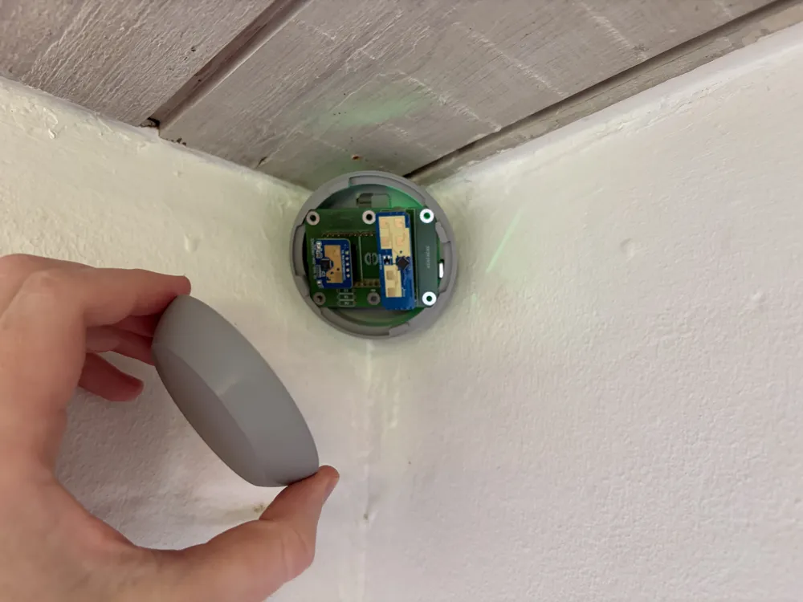
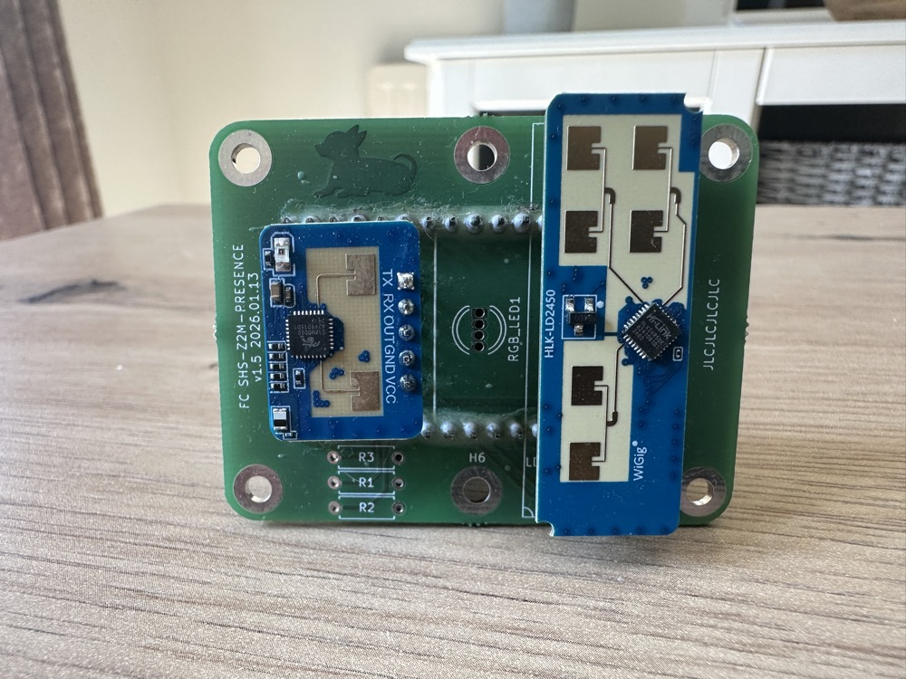
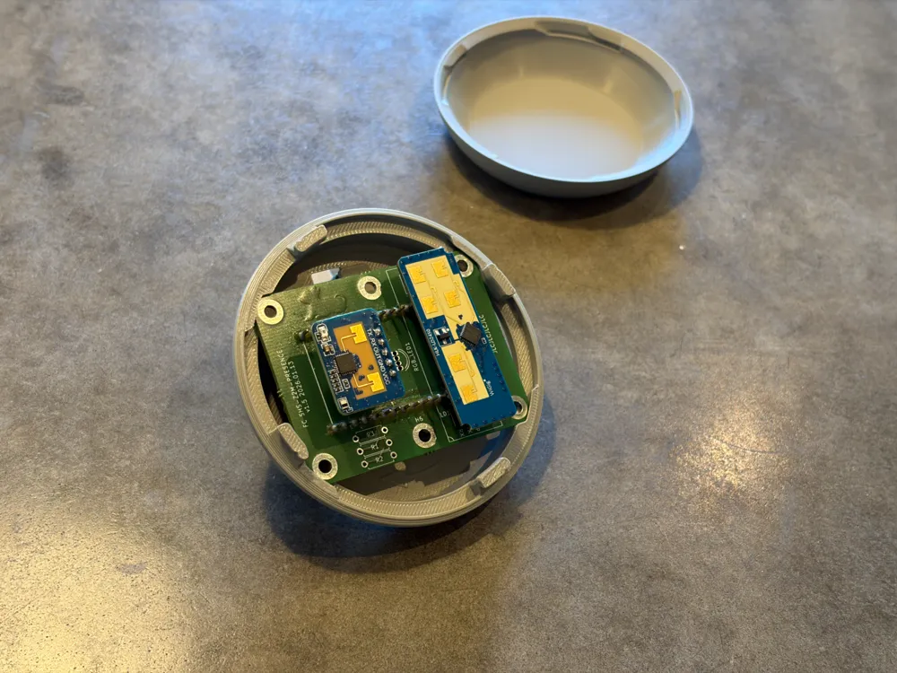
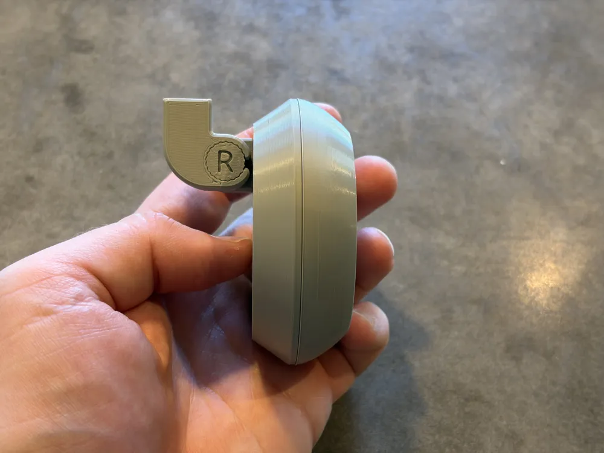
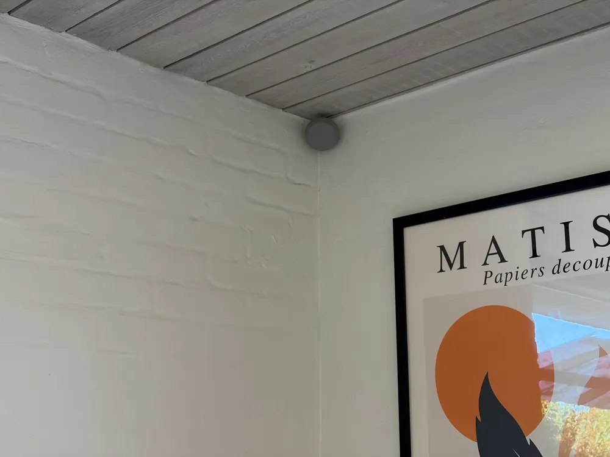

# SHS-Z2M-Presence

**Dual mmWave Presence Sensor Firmware for ESP32-C6 with Zigbee2MQTT Support**



---

## Overview

This project is a continuation of the original [**Smart Home Scene** DIY Zigbee mmWave presence sensor](https://smarthomescene.com/guides/diy-zigbee-mmwave-presence-sensor-with-esp32-c6-and-ld2410/) made for the ESP32-C6 + LD2410. This enhanced firmware now supports the **LD2450** sensor for **multi-zone detection** and **multi-target tracking** (up to 3 simultaneous targets).

The sensor is fully compatible with **Zigbee2MQTT** and works seamlessly with Home Assistant.

### Companion Home Assistant Add-on


For the best experience, install the **SHS Z2M Presence Zone Configurator** add-on for Home Assistant. It allows you to:

- Create rooms with custom floor plans
- Add furniture and obstacles to your map
- Draw and configure detection zones visually
- Set up interference zones to filter false positives
- Real-time target tracking visualization

**[SHS Z2M Presence Zones Add-on →](https://github.com/notownblues/SHS-Z2M-Presence-Zones)**

---

## Community

I wanted to thank both **u/otherworld-dev** and **Rune** from [runesblog.com](https://runesblog.com) for their amazing contributions to this project. It's been incredible to see people work together on this, and also the support this project has received from the community.

### Custom PCB — by u/otherworld-dev

After discovering this project on r/homeassistant, u/otherworld-dev designed a custom PCB that integrates the ESP32-C6, LD2410C, and LD2450 into a single clean board — no breadboard or loose wiring required.

> ⚠️ **The PCB is only compatible with the [ESP32-C6-DevKitC-1-N8](https://eu.mouser.com/ProductDetail/Espressif-Systems/ESP32-C6-DevKitC-1-N8).** Other ESP32-C6 boards will not work as the pins won't align properly with the PCB.

| | |
|---|---|
|  |  |

**[Order the PCB on PCBWay →](https://www.pcbway.com/project/shareproject/SHS_Z2M_Presence_ESP_32_439c9c21.html)**

### 3D Printed Case — by Rune (runesblog.com)

I came across [Rune's work](https://www.facebook.com/groups/HomeAssistant/permalink/4289785924626078/) in the Home Assistant Facebook group a few months back. He'd been designing enclosures for ESP boards which I loved. I reached out, and he was kind enough to design a case specifically for this project. Please make sure to check his work at [runesblog.com](https://runesblog.com).

| | |
|---|---|
|  |  |
|  |  |

**[Download the 3D model on MakerWorld →](https://makerworld.com/en/models/2959145-shs-z2m-presence-adjustable-case-mount#profileId-3316652)**

---

## Hardware Requirements

| Component | Purpose |
|-----------|---------|
| ESP32-C6 | Zigbee-enabled microcontroller |
| LD2410C | Presence detection (moving/static) |
| LD2450 | Multi-target position tracking & zones |

---

## Hardware Setup

Choose the setup option that best matches your situation:

### Option 1: Custom PCB

The easiest path. The [community-designed PCB](#custom-pcb--by-uotherworld-dev) integrates all components on a single board — flash the firmware and pair the device, no wiring needed.

**[Order on PCBWay →](https://www.pcbway.com/project/shareproject/SHS_Z2M_Presence_ESP_32_439c9c21.html)**

### Option 2: 3D Printed Case

Pair the custom PCB with Rune's adjustable ceiling mount case for a clean, finished install.

**[Download on MakerWorld →](https://makerworld.com/en/models/2959145-shs-z2m-presence-adjustable-case-mount#profileId-3316652)**

### Option 3: Standard ESP32-C6 Wiring

For a DIY build on a bare ESP32-C6 development board.


#### LD2410C
- TX (LD2410C) → GPIO4 (RX1) on ESP32-C6
- RX (LD2410C) → GPIO5 (TX1) on ESP32-C6
- VCC → 5V
- GND → GND

#### LD2450
- TX (LD2450) → GPIO19 (RX0) on ESP32-C6
- RX (LD2450) → GPIO18 (TX0) on ESP32-C6
- VCC → 5V
- GND → GND

> **Note:** Some ESP32-C6 boards have 2 x 5V pins and some have one. Both sensors can share the same 5V pin or use separate ones if available.

---

## Sensor Orientation

When placing the LD2450 sensor in your case, ensure the sensor is oriented exactly as shown in the image below.


The 4 antenna patches (gold squares) must be positioned at the **top** of the enclosure, facing your detection area. This is critical for correct coordinate mapping.

> ⚠️ **Important**: Incorrect sensor orientation will result in inverted target coordinates in the [SHS Z2M Presence Zones Add-on](https://github.com/notownblues/SHS-Z2M-Presence-Zones).

---

## Features

- **Dual Sensor Cross-Validation**: LD2410C and LD2450 work together to reduce false positives
- **Multi-Zone Support**: Up to 5 configurable zones with different operation modes
- **Zone Shapes**: Each zone is a rectangle or a polygon of up to 8 corners, so zones can follow the walls on a corner mount
- **Multi-Target Tracking**: Track up to 3 simultaneous targets with X/Y positions
- **Zone Types**: Detection (inclusion), Filter (exclusion), and Interference (false positive filtering)
- **Room Boundary**: Ignore targets outside your room's outline (up to 8 corners), without using a zone
- **Zigbee Router Mode**: Stable connection that also extends your Zigbee mesh
- **Wireless Updates (OTA)**: Update the firmware from the Zigbee2MQTT OTA tab, no USB needed (v1.2.0+, see [OTA Updates](#ota-updates-via-zigbee2mqtt))
- **Persistent Configuration**: Zone settings saved to flash memory

---

## Firmware Flashing

  ### Option 1: Flash firmware with ESPHome Web (Recommended)

  The easiest way to flash the firmware (no development environment needed).

  1. Download `SHS_Z2M_Presence_vX.X.X_merged.bin` from the [Releases page](https://github.com/notownblues/SHS-Z2M-Presence/releases)

  2. Go to [ESPHome Web Tool](https://web.esphome.io/)

  3. Click **"CONNECT"** and select your ESP32-C6 serial port

  4. Once connected, click **"INSTALL"**

  5. Select **"Choose File"** and pick the downloaded `.bin` file

  6. Click **"INSTALL"** and wait for completion (~15 seconds)

  > **Tip:** If the device isn't detected, hold the **BOOT** button while plugging in the USB cable, then try again.

  > **Note:** From v1.2.0 the firmware uses a 4MB flash layout with two app slots for [OTA updates](#ota-updates-via-zigbee2mqtt). Once a device runs v1.2.0 or later, it can be updated wirelessly from Zigbee2MQTT instead of over USB.

  ### Option 2: Build from Source

  For developers who want to modify the firmware or build from source, follow the complete tutorial by Smart Home Scene:

  [DIY Zigbee mmWave Presence Sensor with ESP32-C6 and LD2410 →](https://smarthomescene.com/diy/diy-zigbee-mmwave-presence-sensor-with-esp32-c6-and-ld2410/)
  
---

## Setting Up the Zigbee2MQTT Converter

After pairing your sensor, you need to add the external converter to Zigbee2MQTT for full functionality.

### Which converter file to use

| File | Z2M Version | Module Format |
|------|-------------|---------------|
| `shs01_enhanced.mjs` | **2.0+** (recommended) | ES Module |
| `shs01_enhanced.js` | **1.x** (legacy) | CommonJS |

> **Note:** Zigbee2MQTT 2.0+ requires `.mjs` (ES Module) converters. If your device shows as `"NOT supported"` or the converter file gets renamed to `.invalid`, you need the `.mjs` version.

Download the correct converter from the [Releases page](https://github.com/notownblues/SHS-Z2M-Presence/releases) and copy it to your Zigbee2MQTT external converters folder:

**For Home Assistant Add-on:**
```
/homeassistant/zigbee2mqtt/external_converters/
```

**For Docker/Standalone:**
```
/opt/zigbee2mqtt/data/external_converters/
```

> **Important:** Only place **one** converter file in the directory (either `.mjs` or `.js`, not both). Remove any old converter files or `.invalid` copies for this device.

Restart Zigbee2MQTT for the changes to take effect. Your device should now expose all available entities.

If some or all entities show as "Null" or "N/A", click the "Configure" button straight after pairing to refresh the states.

---

## OTA Updates via Zigbee2MQTT

From firmware **v1.2.0**, the sensor can be updated over Zigbee from the Zigbee2MQTT **OTA** tab, so you don't have to unmount it and plug in USB.

### One-time setup

1. **Flash the latest firmware over USB** (v1.2.0 or newer) using [Firmware Flashing](#firmware-flashing). Older firmware has no room for a second app slot, so this one flash must be done by cable. Every later update can go over the air.
   > **Note:** Flashing a merged `.bin` resets the settings stored on the device (sensitivities, cooldowns, zones and room boundary) to their defaults. Zigbee pairing data is stored in a separate area that isn't touched, so the sensor normally stays paired. If it doesn't reappear in Z2M, pair it again. Afterwards, send your zones again with **Save to Sensor** in the Zone Configurator add-on.
2. **Update the converter** to the latest `shs01_enhanced.mjs` (or `.js` for Zigbee2MQTT 1.x) from the [Releases page](https://github.com/notownblues/SHS-Z2M-Presence/releases) and restart Zigbee2MQTT.
3. **Re-interview the device:** in Z2M open the device, go to **About**, and click **Interview**. Z2M learns about the OTA cluster during the interview.
4. **Add the OTA index to `configuration.yaml`** (see below), then restart Zigbee2MQTT.

### Adding the OTA index to configuration.yaml

Zigbee2MQTT only knows about SHS01 updates once you point it at this repository's OTA index. Open Zigbee2MQTT's own `configuration.yaml`:

- **Home Assistant add-on:** `/homeassistant/zigbee2mqtt/configuration.yaml` (edit it with the File editor or Studio Code Server add-on)
- **Docker / standalone:** `data/configuration.yaml` in your Zigbee2MQTT folder

Add an `ota:` section at the **top level** of the file. The end of the file is a good place, for example just before the `version:` line:

```yaml
blocklist: []
ota:
  zigbee_ota_override_index_location:
    https://raw.githubusercontent.com/notownblues/SHS-Z2M-Presence/main/ota/index.json
version: 5
```

The indentation matters. A mistake stops Zigbee2MQTT from starting.

| Line | Indentation |
|------|-------------|
| `ota:` | none: it starts at the left edge, like `mqtt:` or `serial:` |
| `zigbee_ota_override_index_location:` | 2 spaces |
| `https://raw.githubusercontent.com/...index.json` | 4 spaces, on its own line |

Rules to follow:
- Use spaces only, never tabs.
- If your file already has an `ota:` section, don't add a second one. Put the `zigbee_ota_override_index_location:` line and the URL line inside the existing section.
- The Home Assistant File editor shows a **green tick** at the top right when the file is valid and a **red icon** when it isn't. Don't restart Zigbee2MQTT while it shows the red icon.

Save the file and restart Zigbee2MQTT.

### Updating

1. In Z2M, open the **OTA** tab and click **Check for new updates** next to the sensor. Z2M also checks once a day on its own.
2. If a newer version is listed, click **Update firmware**.
3. Leave the sensor powered. With Z2M's default OTA settings, a full image (~700 KB) takes **about an hour**. The sensor keeps detecting and reporting during the download.
4. When the download finishes, the sensor restarts into the new firmware and reconnects.

If the download is interrupted or aborted, the sensor keeps running its current firmware. Start the update again.

### Safety: automatic rollback

After an OTA update, the new firmware must reconnect to your Zigbee network within 10 minutes. If it crashes or can't rejoin, the sensor automatically switches back to the previous firmware.

### Troubleshooting

| Problem | What to check |
|---------|---------------|
| Zigbee2MQTT doesn't start after editing `configuration.yaml` | The YAML is probably invalid. Check the indentation of the `ota:` lines (see above), and that there's only one `ota:` section. The add-on **Log** tab names the line that's wrong. |
| The sensor isn't listed in the OTA tab | The device runs firmware older than v1.2.0 (check **About** → *Firmware version*), or it hasn't been re-interviewed since flashing. Flash over USB or click **Interview**. |
| "No update available" | The sensor already runs the latest release. |
| Zigbee2MQTT hangs after `Serialport opened` and keeps restarting | The Zigbee coordinator stick isn't responding; this is unrelated to OTA. Stop Zigbee2MQTT, unplug the stick for 30 seconds, plug it back in and start Zigbee2MQTT again. |

---

## What the Sensor Exposes

Once properly configured, the sensor exposes the following entities in Zigbee2MQTT:

### Occupancy & Detection

| Entity | Description |
|--------|-------------|
| `occupancy_ld2410` | LD2410C presence detection (moving or static) |
| `occupancy_ld2450` | LD2450 overall presence (based on target count) |
| `moving_target` | Moving target detected by LD2410C |
| `static_target` | Static target detected by LD2410C |
| `ld2450_target_count` | Number of active targets (0-3) |

### Zone Detection

| Entity | Description |
|--------|-------------|
| `zone1_occupied` - `zone5_occupied` | Binary occupancy per zone |
| `zone_1_targets` - `zone_5_targets` | Target count per zone |

### Position Data (Config Mode Only)

| Entity | Description |
|--------|-------------|
| `target1_x`, `target1_y`, `target1_distance` | Target 1 position (mm) |
| `target2_x`, `target2_y`, `target2_distance` | Target 2 position (mm) |
| `target3_x`, `target3_y`, `target3_distance` | Target 3 position (mm) |

### Configuration Options

| Entity | Range | Description |
|--------|-------|-------------|
| `moving_cooldown` | 0-300s | Time before motion clears |
| `occupancy_delay` | 0-300s | Time before occupancy clears |
| `moving_sensitivity` | 0-10 | Moving detection sensitivity |
| `static_sensitivity` | 0-10 | Static detection sensitivity |
| `moving_max_distance` | 0-6m | Maximum moving detection range |
| `static_max_distance` | 1.5-6m | Maximum static detection range |
| `position_reporting` | On/Off | Enable Config Mode |

---

## Config Mode (Position Reporting)

The firmware includes a **Config Mode** that enables real-time position reporting. This mode is essential for configuring zones and visualizing target tracking in the Zone Configurator add-on.

### Activating Config Mode

Config Mode can be activated via:

1. **Zigbee2MQTT**: Toggle the `position_reporting` switch ON
2. **Zone Configurator Add-on**: Click the "Enable Position Reporting" button
3. **Physical Button**: Click the BOOT button **3 times** quickly

To deactivate, use the same methods (toggle OFF, click button, or 3 more clicks).

When Config Mode is activated or deactivated, the onboard LED will toggle to provide visual feedback.

### ⚠️ Important Warnings

> **Use Config Mode only during zone configuration!**

Config Mode streams X/Y coordinates, distances, and target data continuously, generating **significantly more Zigbee traffic** than normal operation.

**Testing Results:**
This mode was tested for 2 weeks during 5-10 minutes at a time on a network with 100+ devices using a ZBDongle-P coordinator and did not cause any network crashes. However, every setup is different. If your network already has "chatty" devices, prolonged use of Config Mode could potentially cause instability.

**Best Practices:**
- Enable Config Mode only while actively configuring zones in the Zone Configurator
- Disable it immediately after completing your configuration
- The sensor works perfectly without Config Mode — zone detection and occupancy function independently

When Config Mode is OFF, the sensor still processes zones locally and reports occupancy states correctly. Only the real-time position streaming is disabled.

---

## Zone Types

The sensor supports 4 zone operation modes:

| Type | Behavior | Use Case |
|------|----------|----------|
| **Off** | Zone disabled | Default state |
| **Detection** | Only detect targets INSIDE zones | Focus on specific areas (bed, desk, couch) |
| **Filter** | Ignore targets INSIDE zones | Exclude areas (doorways, windows with moving curtains) |
| **Interference** | Treat targets as false positives | Filter reflections and sensor artifacts |

The global **Zone Mode** (Off / Include / Exclude) decides how Detection zones affect the main occupancy:

- **Off**: every target counts.
- **Include**: only targets inside a Detection zone count.
- **Exclude**: only targets outside all Detection zones count.

Interference zones are always ignored, whatever the mode. If no Detection zones are enabled, every target outside Interference zones counts.

## Zone Shapes

Zones are rectangles along the sensor's own axes. Since firmware v1.3.0 each zone can instead be a polygon of up to 8 corners. That matters for a corner mount: the sensor's axes are then at 45° to the walls, so a zone that is square to the room (over a dining table, say) is a tilted shape for the sensor. The [Zone Configurator add-on](https://github.com/notownblues/SHS-Z2M-Presence-Zones) (v2.10.0+) sends polygons automatically. Polygon zones work with every zone type and Zone Mode, and are stored in flash.

Zigbee attributes (Config cluster `0xFDCD`, endpoint 1): zone N (1-5) uses the block starting at `0x0100 + (N-1) * 0x20`. `+0` is the point count (uint8, below 3 = use the rectangle) and `+1`..`+16` the x/y of up to 8 points (int16, mm, sensor coordinates), so zone 1 is `0x0100`-`0x0110` and zone 5 is `0x0180`-`0x0190`. The converter accepts them as `zone_config.zoneN_polygon: [{x, y}, ...]`; an empty array switches the zone back to its rectangle. Keep sending `zoneN_x1`..`zoneN_y2` as well: older firmware ignores the polygon and uses the rectangle.

## Room Boundary

Since firmware v1.1.0 the sensor can ignore targets outside a room outline, for example people seen through a wall. Draw it with the Room Outline tool in the [Zone Configurator add-on](https://github.com/notownblues/SHS-Z2M-Presence-Zones) and click Save to Sensor.

Targets outside the outline don't count towards occupancy, the target count, zone occupancy, or the LD2410C cross-check. Position reporting still shows them, so the add-on can draw them faded. The outline is stored in flash and doesn't use any of the 5 zones.

Zigbee attributes (Config cluster `0xFDCD`, endpoint 1): `0x0070` point count (uint8, below 3 = off) and `0x0071`-`0x0080` the x/y of up to 8 points (int16, mm, sensor coordinates). The converter accepts them as `zone_config.boundary: [{x, y}, ...]`.

---

## Dual Sensor Interference Mitigation

During development and testing, I discovered that the LD2450 was causing interference on the LD2410C. This resulted in false presence triggers every few minutes with sudden energy spikes, even when no one was in the room.

**Solution implemented:** The LD2410C presence is only reported if the LD2450 has also detected at least one target. This cross-validation approach significantly reduces false positives while maintaining reliable detection.

---

## Credits

This project would not have been possible without the excellent work from **[Smart Home Scene](https://smarthomescene.com)**. Their original DIY Zigbee mmWave presence sensor guide and firmware provided the foundation for this enhanced version.

**Original Project:** [DIY Zigbee mmWave Presence Sensor with ESP32-C6 and LD2410](https://smarthomescene.com/guides/diy-zigbee-mmwave-presence-sensor-with-esp32-c6-and-ld2410/)

---

## Contributing

Contributions are welcome! Feel free to:

- **Report issues** or bugs you encounter
- **Submit feature requests** for improvements
- **Create pull requests** with fixes or new features
- **Design enclosure cases** — I would love to see community-designed cases for this sensor!

If you find this project useful, consider giving it a star!


